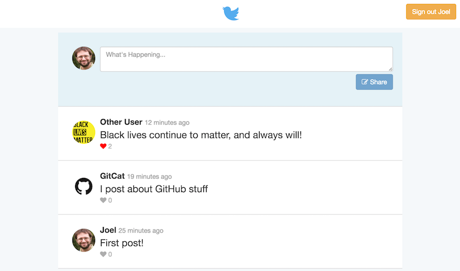
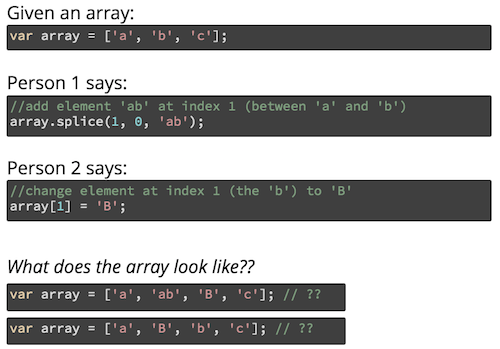

# Firebase Tutorial
This repository contains starter code for creating a Twitter clone called **Chirper** as a tutorial for learning the [Firebase](https://firebase.google.com/) library. Follow the below steps, reading the instructions carefully for explanations about how to use this library to do user authentication and save data in the cloud!

## What is Firebase?
[**Firebase**](https://firebase.google.com/) is a web service that provides tools and infrastructure for use in creating web and mobile apps that store data online in the cloud (a "web backend solution"). In effect, Firebase acts as a _server_ that can host information for us, so that we can just build client-side applications without needing to program a web server.

In particular, you can think of Firebase as providing a **"giant JSON Object in the Cloud"**&mdash;you can refer to this object as a variable in your JavaScript code, make changes to it with functions, and have the changes easily be reflected in the cloud and on other client computers viewing the same web page. In effect you can create a **data binding** between clients and the server, so that if you update data on one machine, that change automatically appears on the other. Real-time updates!

- Firebase is owned and maintained by Google, but will still work perfectly fine with Facebook's React framework.

In addition to the database, the Firebase service offers a client-side based system for performing **user authentication**, or allowing users to "sign in" to your application and have particular information associated with them. It's possible to have users sign up with an email and password, or even using an external service (e.g., "sign up with Facebook"). Firebase also provides all those extra details associated with accounts, like being able to reset passwords. And this is all performed securely from the client-side, without the need to set up an additional server to perform OAuth work.

These features mean that Firebase can be a go-to back-end for producing a client-side app that involves persisted data (like user accounts). And its [free service tier](https://firebase.google.com/pricing/) is perfectly suited for any development app.

- _Important note_: Firebase updated to version 3.0 in **May 2016** (5 months ago at this writing). This was a massive revision to the API, so watch out for out-dated "legacy" examples.

## What You'll Do
We've got 90 minutes, so let's build Twitter. 



By following this tutorial, you'll create **Chirper**: a simple social networking system that allows users to post "chirps" which can be seen by all other signed in users. Users can even like (heart) the chirps!

The app will include the following features:

1. User sign-up and authentication
2. User-specific data (usernames and avatar pictures)
3. The ability to post new chirps
4. Real-time updates as new chirps are posted 
5. Liking existing chirps

### Resources

- [Firebase Web Guide](https://firebase.google.com/docs/web/setup)
- [Firebase Authentication](https://firebase.google.com/docs/auth/)
- [Firebase Realtime Database Guide](https://firebase.google.com/docs/database/web/start)

## Firebase Setup
Setting up firebase involves a number of steps:

1. **Sign up for the service** You will need to sign up for the Firebase service to use it, though you can sign in with your UW email if you've set it up as a Google account.

    Visit [https://firebase.google.com/](https://firebase.google.com/) and click the "Get Started for Free" button. Sign in with your Google Account.
    
2. **Create a Firebase App** You need to create a new project (per application) for the Chirper app you're building. Click the "Create New Project" button to do so.

    In the pop-up window that appears, you'll need to give the app a unique name. Try `chirper-your-uw-id`.
 
3. After you create the project, you will be taken to the **Console** for your project. This is a web page where you will be able to manage the configuration of your project, as well as view and even modify the "JSON-Object-in-the-Cloud" (JOITC) for your data.

    Navigation menus are on the left-hand side; we will be using some of these tabs as we go.
    
4. **Add Firebase to Web Page** Now you'll need to add the Firebase library to your web page, as well as some configuration data to make sure your page connects to the App you just created.

    Click on the "Add Firebase to your web app" button. This will provide you some HTML code for loading the Firebase library, as well as an inline `<script>` that configures your app to use Firebase. 
    
    However, we'd like to use the React app structure to organize our code, rather than modifying the HTML. **Instead**, you should add the following to your **`index.js`** file:
    
    1. `import` the firebase library (it was already listed as a dependency in your `package.json` so should be installed:

        ```javascript
        import firebase from 'firebase';
        ```
        
        (You will also need to import the library in `App.js` and `Chirps.js`).

    2. **Copy and paste** the the script file from the Firebase webpage (The `// Initialize Firebase ...` part). Do this _before_ the `ReactDOM.render()` call.

Be sure to open the web page (from the `npm start` local webserver) and _check the developer console for errors_ to confirm that everything is set up and integrated correctly. You should see a basic logo at the top of the page (and that's about it).

## User Authentication
We'll start by enabling user authentication: allowing users to sign up for and log into Chirper.

1. **Enable authentication in Firebase** 

    First you'll need to set up your Firebase App (in the cloud) to support user authentication. On the Firebase Console web page, click on the "Auth" tab in the side-bar on the left:

    

    Then under "Sign-In Method" tab (at the top), you'll need to select the **"Email/Password"** object and **Enable** it. This turns on Firebase's ability to manage users by authenticating them through an email and password.

2. **Render the sign-up form** 

    Next we want to show the sign-up form on the web page. A Component that creates this form has already been defined in the `SignUp.js` file: you will need to `import` this Component into your **`App.js`** file:

    ```javascript
    import SignUpForm from './SignUp';
    ```

    If you then look at the `App` component's `render()` method, you should see an "if" statement that checks whether a user is logged in. In this condition, you will need to _instantiate_ a new `<SignUpForm />` and assign it to the `content` variable (which will be _returned_ as part of the rendered DOM, which you can see if you scroll down slightly). 
    
    The `<SignUpForm />` Component takes two props: `signUpCallback` which is a _function_ that should be called when the user signs up for the service, and `signInCallback` which is a _function_ that should be called when the user signs in. Pass the appropriate functions from the `App` component as values for these props.
    
    Once you've done this, you should now see the signup form appear!
    
    - This is an example of **conditional rendering**&mdash;we're only showing the form when the user is not logged in yet.

    **IMPORTANT TIP** You don't need to come up with real email addresses for testing. Try using `a@a.com`, `b@a.com`, `c@a.com`, etc. Similarly, `password` works fine for testing passwords (though you should never do that in real life!)

    - You can also view all the users you create on the Firebase Web Console (under Auth > Users) once you have some, as well as do things like delete any testing accounts.


3. **Create user** 

    Finally, we can actually go ahead and create a user from the `signUp()` function. To do this, you'll use a function provided by Firebase (you did remember to `import firebase` right?). In particular, you'll call the wordily-named function [`firebase.auth().createUserWithEmailAndPassword`](https://firebase.google.com/docs/reference/js/firebase.auth.Auth#createUserWithEmailAndPassword) passing it the email and password from the form. This will create a new user account in Firebase (you can view it in the Firebase Web Console), _as well as_ log in the user.
    
    - This function is called on [`firebase.auth()`](https://firebase.google.com/docs/reference/js/firebase.auth.Auth), which gets an "authenticator" object that can manage user login information.

    The `createUser...` method returns a _Promise_, so you should use the `.then()` method to do further work after the user is created (e.g., logging out that they have been created):
    
    ```js
    firebase.auth().createUserWithEmailAndPassword(email, password)
       .then(function(firebaseUser) {
          console.log('user created: '+firebaseUser.uid);
          //...
       })
       .catch(function(error) { //report any errors--useful!
          console.log(error);
       });
    ```

    The Promise callback is passed a ["firebaseUser"](https://firebase.google.com/docs/reference/js/firebase.User) object, which contains data about the user who has just been created and signed in. The most important property of this object is the **`firebaseUser.uid`**, which is the _unique id_ of that user generated by Firebase. This is like the "internal codename" for users that we'll use to keep track of them.

   - **IMPORTANT TIP** You don't need to come up with real email addresses for testing. Try using `a@a.com`, `b@a.com`, `c@a.com`, etc. Similarly, `password` works fine for testing passwords (though you should never do that in real life!)

        You can also view all the users you create on the Firebase Web Console (under Auth > Users).

4. **Render login views**

    In fact, you can use this `uid` to keep track of which user is signed in. Assign that `uid` to a the **`state`** using `this.setState()` (name the state field `userId`), and when you sign up on the page you should now see a "Logout" button that is conditionally displayed when the user is logged in.
    
    Along similar lines, in the `render()`, assign a value to the `content` variable when the user _is_ logged in. This variable should contain a `<ChirpBox />` component and a `<ChirpList />` component. You will need to `import` these components:
    
    ```js
    import { ChirpBox, ChirpList } from './Chirps';
    ```         
    
    Remember to wrap them in a `<div>` so that you're only assigning a single element to the variable! Once this works, you should see the "chirping" page whenever the user logs in.

5. **Save profile information**

    But what about the Handle and Avatar from the sign-up form? Firebase will let us save this specific information in the user's account (alongside their email and password) as part of their ["profile"](https://firebase.google.com/docs/auth/web/manage-users#update_a_users_profile).
    
    You'll need to add the handle and avatar to the user's profile inside the `createUser...` callback function (since we need the information submitted by the form). You can do this by calling the `firebaseUser.updateProfile()` function, and passing it an object containing the profile data you want to update. The handle should be assigned to the `displayName` property, and the avatar should be assigned to the `photoURL` property. See the above link for an example.

    - This function returns a _Promise_. If you then _return_ that promise from inside the `.then()` callback, any errors in setting the profile will be printed from your `.catch()` further down the chain! For example:

        ```js
        firebase.auth().createUserWithEmailAndPassword(...) //any errors will be "caught" below
           .then(function(firebaseUser) {
              var profilePromise = firebaseUser.updateProfile({...});
                
              return profilePromise; //any errors will be "caught" below
            
           })
           .catch(console.log) //print ANY errors from previous promises
        ```
    
    - **NOTE** You will need to create a new user to test this, since your previous users won't have saved their information.

    We can later use this profile information _for the current user_ by accessing them on the `firebase.auth().currentUser` object. For example
    
    ```js
    //log the current user's display name ("handle")
    console.log(firebase.auth().currentUser.displayName)
    ```
    
    Modify the `render()` function so that the logout `<button>` shows the current user's `displayName` instead of `"User Name"`. Now you will know who is logged in!
    
    - Note that to keep our code simpler, you may need to log out and then log in again to see this.
    

6. **Handle authentication events**

    It would be nice to stop having to create a new user every time you wanted to test something, and for the page to remember when someone is signed in (e.g., as we constantly refresh). To do this, we want to generalize the problem: whenever something changes (e.g., the page loads, or someone signs in or out), we want to "update" our `state` variable. We can respond to this change _whenever_ by using an event listener&mdash;similar to how we've dealt with click events, etc.
    
    We're going to need to register this event listener when the Component is first created, so that we can respond to events all the time. While this would suggest putting the listener in the `constructor`, we want to make sure that the Component has _finished_ being created before we try to update its state through an event handler. To do that, we're going to register the event listener in a method that React automatically calls **after** the Component is created (and displayed on the DOM) called [`componentDidMount()`](https://facebook.github.io/react/docs/react-component.html#componentdidmount). This is known as a ["lifecycle method"](https://facebook.github.io/react/docs/react-component.html#the-component-lifecycle), and is a better place than the constructor to put initialization and data-fetching work that would cause the `state` to "update".
    
    - You will need to add this method to your `App` Component. It's usually listed immediately _below_ the `constructor()`.
    
    Inside `componentDidMount()` we can register our event listener. Firebase provides a function called [`onAuthStateChanged`](https://firebase.google.com/docs/reference/js/firebase.auth.Auth#onAuthStateChanged) which takes in a _callback_ that will be executed whenever the "authorization state" changes: so whenever someone signs in or out. We can pass this listener a callback which will assign our `userId` when some signs in, or "unassign" (make it `null`) when someone signs out:
    
    ```js
    firebase.auth().onAuthStateChanged(firebaseUser => {
	   if(firebaseUser){
	      console.log('logged in');
	      //assign firebaseUser.uid to `userId` using this.setState()
	   }
	   else {
		  console.log('logged out');
	      //assign null to `userId` using this.setState()
	   }
    });
    ```
    
    - Notice that the above code using an [arrow function](https://github.com/metagrover/ES6-for-Humans#2-arrow-functions) to specify the callback function. This not only makes the code slightly shorter, but it _automatically binds `this`_ so we don't have to worry about that!

    The page should now remember that the user is logged in on a page refresh.

7. **Signing out and signing in** 

    As a last step for authentication, we want to make sure the "Sign Out" buttons and "Sign In" buttons work (the "Sign In" button will sign in an existing user given the correct email and password). Firebase provides helpful methods for this, and I've provided you examples to save time.

    ```js
    signIn(email, password) {
       //Firebase method that does what it says on the tin
       firebase.auth().signInWithEmailAndPassword(email, password)
          .catch(err => console.log(err)); //log any errors for debugging
    }
        
    signOut(){
       //another obvious Firebase method
       firebase.auth().signOut()
    }
    ``` 

## User-Specific Data
Now that you can sign people in and out, we want to also be able to save user-specific information (e.g., their Handle and Avatar picture). To do this, we're going to save those variables in Firebase's "JSON Object in the Cloud" (JOITC), also known as the [realtime database](https://firebase.google.com/docs/database/web/start). We're going to produce a JSON object that has the following structure:

```json
{
  "users" : {
    "user-id-hash-1" : {
      "avatar" : "https://assets.ischool.uw.edu/ai/joelross/pci/joelross-1...",
      "handle" : "Joel"
    },
    "user-id-hash-2" : {
      "avatar" : "https://pbs.twimg.com/profile_images/564864902561415168...",
      "handle" : "Other User"
    },
    ...
  }
}
```

That is, the "JSON Object in the Cloud" will have a key `users` that refers to an object. That `users` object will have keys that correspond with the Firebase generated user ids (the `firebaseUser.uid` variable you've worked with), with a value for each key that is yet _another_ object containing the `handle` and `avatar` keys. Thus we would be able to refer to someone's handle as: `myChirperDatabase.users[userId].handle`.

In Firebase's Web Console, this will look something like:


### Security Rules
Because Firebase is just a giant JSON object in the cloud and is usable from a client-side system, technically _anyone_ can access it. Each element of the JSON object is accessible through a particular URI (e.g., `https://chirper-myname.firebaseio.com/users/user-id-hash-1/handle`); all we'll do from our code is send AJAX requests (via Firebase functions) to `GET` and `POST` to this resource.

In order to keep information from being 100% publicly available, Firebase lets you define [security rules](https://firebase.google.com/docs/database/security/) that specify what users can access which elements. For example, we can make it so that only authenticated users can modify their handle or avatar. These rules are defined using a JavaScript-like syntax, and can be quite complex if you want to include very specific forms of access control. We'll just include enough basic rules to get us started, but you are encouraged to read through the documentation for more details (e.g., for your final projects!)

In order to set up the security rules, you need to go to the Realtime Database in the Firebase Web Console:


This is where you can see the "JSON Object in the Cloud" as it currently exists.

Click on the "Rules" tab at the top and replace the content with the following:

```json
{
  "rules": {
	".read": true,
  	"users": {
      "$uid": {
        ".write": "auth.uid === $uid"
      }
    }
  }
}
```

This specifies that _all_ elements are readable by everyone (which means that you can see all the data without logging in. Note that the emails and passwords are **not** stored in this JOITC!). It then specifies that inside the `users` element, the element with the `uid` key can only be _written_ (modified) by a user who has been authenticated and has that same `uid`.

Be sure and hit "Publish" to save your changes!

- These examples are taken from the [quickstart guide](https://firebase.google.com/docs/database/security/quickstart#sample-rules), which has a good set of sample rules to start with.


### Saving Data
Now we can add code to our Component to start interacting with the JOITC database. In particular we're going to save the user's handle and avatar in the JOITC _in addition_ to their individual profile (so in two places). This is because other users can't access their profile information, so if we want to show who posted what tweet, that information needs to be "public" in the JOITC.

1. **Get reference to the database** 

    In order to interact with the database from our JavaScript code, we need to have a variable which _references_ that JSON object. The Firebase library includes a method called `ref()` that let us create these references (it is called on the database, accessed as `firebase.database()`:

    ```js
    //get reference to the "root" of the database: the containing JSON
    var rootRef = firebase.database().ref();
    ```

    We can get elements "inside" this object by passing them as a url-style "path" to the `ref()` method:
    
    ```js
    //refers to the "users" value in the database
    var usersRef = firebase.database().ref('users');
    
    //refers to the "ada" value inside the "users" value in the database
    var adaUserRef = firebase.database().ref('users/ada');
    ```

    This method will create new key/value pairs in the JSON object if they do not already exist.
    

2. **Save the user data** 

    Now that we have a reference to the "users" value in the JOITC, we can save the user's avatar and handle _when we first create a user_ (e.g., just after we save their information in the profile).

    Start by using the `ref()` function to create a reference to a variable in the JOITC for this new user. The "path" parameter should be to the value at `'users/'+firebaseUser.uid`, meaning a value inside the "users" object with a key of the user's unique id:
    
    ```js
    var newUserRef = firebase.database().ref('users/'+firebaseUser.uid);
    ```
    
    Next, create a new local variable called `userData`, which is an object with a key `handle` whose value is the entered handle, and a key `avatar` whose value is the entered avatar url.
    
    You can assign this object to the value in the JOITC by calling `set()` on the reference (to "set" a value for that particular cloud variable). Note that you will have permission to access to this variable because the rule we wrote said so!
    
    ```js
    newUserRef.set(userData); //set the key's value to be the object you created
    ```
    
    You can create a new user and then check the Firebase Web Console to see that the user now has data stored! We will come back and use this information later.


## Posting Chirps
Now that you've seen how to save data in the cloud (and finished getting our user creation working), we can actually go ahead and let the user be able to post new messages (chirps!)

We'll handle posting Chirps inside the `Chirps.js` file, specifically in the **`ChirpBox`** component. _To familiarize yourself with this component_, start by modifying the `render()` method so that the `` source is assigned the current user's `photoURL` (the avatar from the profile). Bonus if you make the ChirpBox show the `noUserPic` image if the avatar was not specified (so is `null`).


1. **Modify the security rules** 

    Again, in order to let clients save data to the cloud, we need to add a security rule. In the Firebase Web Console, add the following object (inside the "rules" key):

    ```json
    "chirps": {
      ".write":"auth != null"
    },
    ```

    This will allow _any_ authenticated user to write to the "chirps" key, which we'll use to store an array of Chirps.

2. **Gather chirp data** 

    We'll handle posting chirps inside the (ahem) `postChirp()` function, which will be called when the user hits the "Share" button. The typed text is available in the **state** as `this.state.post`.

    We'll be saving chirps in the JOITC as an array of objects (_think about why!_). So in the `postChirp()` function, you should create a new object (e.g., `chirpData`) that will represent this single chirp as one item in that array. This object should include the following properties:

    ```
    {
        text: the text in textarea (on the state),
        userId: the current user's `uid`
        time: firebase.database.ServerValue.TIMESTAMP        
    }
    ```
    
    (that last `time` value is a special value that refers to whatever time is on the Firebase server when the data is processed; this is the best way of saving an accurate timestamp with Firebase).

    Log out this object to confirm that all the data looks correct.

3. **Save the data in the cloud**

    To save the data in Firebase, we'll again need to create an entry/key in the JOITC that we can assign a value to. Just as you did before with the "users" key, get a firebase _reference_ to the `'chirps'` key in the JSON Object in the Cloud:
    
    ```js
    var chirpsRef = firebase.database().ref('chirps');
    ```

    You'll then need to "push" the `chirpData` element into that array:
    
    ```js
    chirpsRef.push(chirpData);
    ```
    
    This method returns a promise if you want to try and `catch()` any errors.

4. **Aside: Data format**

    If you look at the chirp you just posted in the Firebase Web Console, you'll see that chirps doesn't look like an array, but like an object whose keys are randomly generated numbers! This is how Firebase stores an array: instead of giving each element an index in order (0, 1, 2, 3, ...), it gives each element a randomly generated `key` as an "index".
    
    - You'd still talk about the element as `chirps[chirpNum]`, but instead of `chirpNum` being a number 0 through `length`, it's a randomly generated String!
    
    Firebase structures things this way to support **concurrency**, or where people can modify the array _at the same time_ from multiple computers. Using an object's keys rather than an array's index to keep track of elements prevents errors occurring or data being lost depending on which person happened to "win the race" and get their change in first:

    
    
    So although Firebase gives us a `push()` function and lets us act like the object is an array, except it is "concurrency-safe" methods to make sure our changes are not lost because someone beat us in a [race condition](https://en.wikipedia.org/wiki/Race_condition#Networking).
    

## Displaying Chirps    
Now we just need to display the chirps that have been posted! We'll do this in the **`ChirpList`** component (which displays a list of `<ChirpItem />` components).

1. **Listen for database changes**

    We will be storing the list of chirps to display in the component's **state** so that when they change over time, we can update what components are shown. But because the firebase can change all the time, we will want to _listen_ for those change events (similar to how we listen for button click events). Firebase provides us a method `.on()` for registering such listeners. For example, the below will listen for changes to the `'users'` key in the JOITC:
    
    ```js
    var usersRef = firebase.database().ref('users');
    usersRef.on('value', (snapshot) => { //arrow function for callback
        var newVal = snapshot.val();
        this.setState({users:newVal});
    });
    ```
    
    (As previously, listener registrations should go in the component's `componentDidMount()` lifecycle method).
    
    The first parameter to the `on()` function is what kind of event we want to listen for: in this case, we're listening for `value` events (e.g., whenever any value in the JOITC reference changes).
    
    The second parameter is a callback function to be executed when the event is heard (written above as an arrow function to handle scoping problems). This callback will be passed a `snapshot` as a parameter, which is an object representing the "new" value in the database. We turn this into a normal JavaScript object by calling the `.val()` function on it. The above code then takes this value and stores it in the **state**, allowing us to access the user details (handles and avatars) when we finally render the chirps.

3. **Unregister the listeners**

    We've connected a listener to the component. But if the component gets removed (e.g., we log out), we want to stop listening for new events&mdash;we won't be able to update the state if the component doesn't exist, causing errors! We'll do this "unregistering" in the `componentWillUnmount()` lifecycle method, which React will call right before the component is removed:
    
    ```js
    /* Add this method to your component! */
    componentWillUnmount() {
       firebase.database().ref('users').off()            
    }
    ```

    We unregister the listener by calling the `.off()` method (to cancel the `.on()`).

3. **Listen for new chirps**

    In addition to listening for changes to the `users` value, we also want to listen for changes to `chirps` value so we can respond to new chirps being added. Add another listener to  the `ChirpList` component (in the `componentDidMount()` function) that will listen for `'value'` changes to the `'chirps'` value. This will look very similar to the above code for listening for changes to `'user'`.
    
    - Remember to "unregister" your listener as well!

    If you just call `.val()` on the `snapshot` of the chirps, we'll get an object because that is what is stored in Firebase. However, we wanted to treat this object as an **array** (pushing elements to it), so that we can "loop" through it and show _each_ chirp. Thus we can't just store the `.val()` directly in the **state**, we need to do some extra processing to store the array we actually want to use:
    
    ```js
    var chirpsArray = []; //an array to put in the state
    snapshot.forEach(function(childSnapshot){ //go through each item like an array
       var chirpObj = childSnapshot.val(); //convert this snapshot into an object
       chirpObj.key = childSnapshot.key; //save the child's unique id for later
       chirpsArray.push(chirpObj); //put into our new array
    });

    this.setState({chirps:chirpArray}); //add to state
    ```
    
    There are a couple of things going on here:

    - We're using Firebase's [`forEach`](https://firebase.google.com/docs/reference/js/firebase.database.DataSnapshot#forEach) function to iterate through each "child" element in the `chirps` snapshot _as if it were an array_. The `forEach` callback will be passed as a parameter another "snapshot" of each key/value pair in the Firebase object (e.g., each chirp that we posted along with its specially generated unique key).

    - We're then using the `.val()` function on this child to actually get our chirp object (the `text`, `userId` and `time` we saved earlier).
    
    - Finally, we're adding in the `key` of the snapshot so that we can refer to that chirp in the database later (this is like writing down the "index" or unique id of that element).

    As a bonus: you can sort the elements in the `chirpsArray` by each elements `.time` in order to show the chirps in reverse chronological order. Do this just before you set it to the **state**. 

4. **Render the `<ChirpItem />` elements**

    To actually show the chirps on the page, you'll need to have the `ChirpList` render them. Modify the `render()` method so that it creates an array of `<ChirpItem />` elements to render. You can do this by calling `.map()` on `this.state.chirps`, just like we've done in the past.

    Inside your `.map()` callback, you should _instantiate_ each `<ChirpItem />` with the following properties:
    
    - **`chirp`**, which should be an object containing the chirp information (e.g., the param to the callback).
    - **`user`**, an object containing the user data (handle and avatar) for the author of this chirp. You can access this object by looking it up in `this.state.users` (remember that?). In particular, by accessing the element whose key is the chirp's `userId`. That is: 

        ```js
        this.state.users[chirpObj.userId]
        ```
    - **`key`** which should be a unique identifier for this item to help React deal with re-rendering. Set this equal to the chirp's `key` that you stored in the object in the previous step! 

    Be sure and actually `return` your array of elements from the `render()` method!

    Once you do this, you should see new Chirps show up on the page, and on multiple browsers as different people post! 

Firebase is awesome!


## Bonus: Liking Chirps
As a final step (and to practice with React and Firebase), try to add functionality that allows the user to "like" (heart) a particular tweet. There are a few steps to this:

1. In the `ChirpItem` component, add an `onClick()` event handler to the heart icon, and add a method for it to call (e.g., `this.likeChirp`)

2. In the `likeChirp()` function (so when the heart is pressed), create a reference to the JOITC's value at `chirps/CHIRP_KEY/likes`, replacing `CHIRP_KEY` with the key to this particular Chirp component (as you may recall, you saved this key in `this.props.chirp.key`)

3. You will want to store each chirp's "likes" as an object whose _keys_ are the userIds of the likers and whose values are simple `true`. Thus everyone who liked the chirp will have a key/value pair in the `chirp.like` object. 

    This will let you determine if someone with a particular `userId` liked that chirp by checking if `chirp.like[userId] === true`, and how many people liked that chirp by counting the number of keys in the object (e.g., from `Object.keys()`).

    This object will exist as part of the chirp prop (`this.props.chirp.likes`) if the chirp has any likes&mdash;assign it to a variable so you can modify it (e.g., `likesObj`). Note that if there aren't any likes yet, you should still create an empty object `{}`.

4. Add the user's current id to the object's keys by giving it a value (e.g., `likeObj[userId] = true`).

    - For extra challenge, try looking at the existing likes so that if the user already liked the chirp, clicking the button again will cause the user to "unlike" it!

5.  Now use `.set()` to assign the updated object to the JOITC (similar to what we did with user details).

6. Now in the `render()` function, you'll need to determine two things:

    1. Whether or not the _current user_ liked the chirp. You can do this by checking if `chirp.like[currentUserId] === true`. Assign this value to the provided `iLike` variable.
    
    2. How many likes the the chirp has. You can do this by counting the number of keys the `chirp.like` object has (e.g., using `Object.keys(chirp.like).length`). Assign value to the provided `likeCount` variable.

This should add in liking functionality, so you can like the stuff you've done.

## Deploy Your App!
The best way to play with this system and enjoy the fruits of your labor is to let multiple people from multiple computers interact with it. Best way to do that? Host it on a webserver!

Commit your changes to the code and then checkout a _new_ `gh-pages` branch. Push this branch to GitHub and you'll be able to access it via GitHub Pages at:

```
https://<username>.github.io/<reponame>
```

Put your Chirper online and have other people send you messages! Because now you know how to use Firebase!